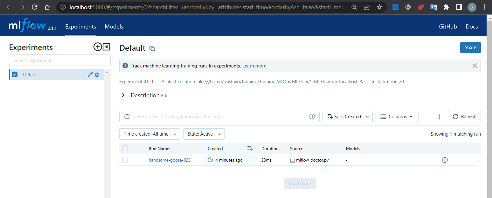
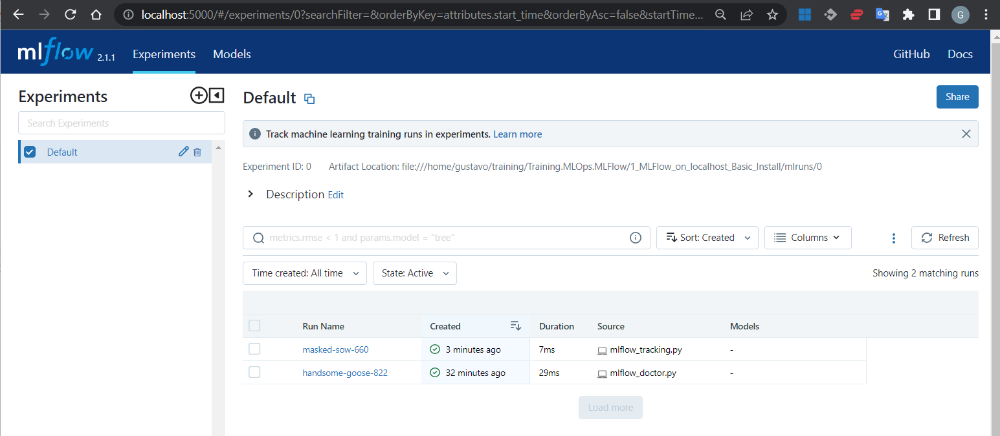
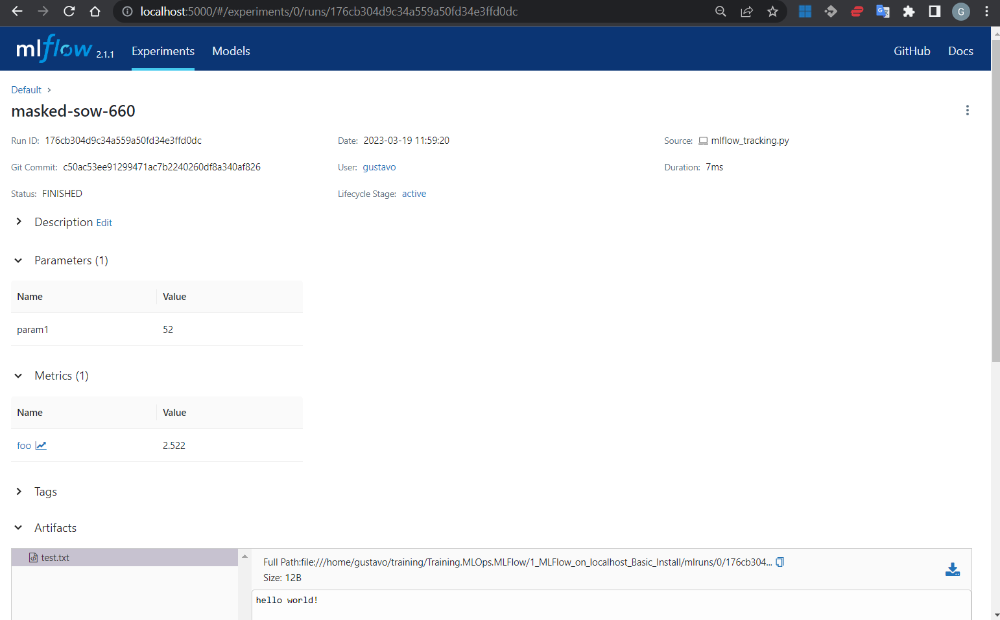

# 1. MLflow install and Hello World
[Go to Root Index](../README.md)

- [1. MLFlow Requirements](#1-mlflow-requirements)
- [2. MLflow system pip install&run](#2-mlflow-system-pip-installrun)
    - [2.1 Install the Official MLflow `pip` packages](#21-install-the-official-mlflow-pip-packages)
    - [2.2 MLflow Tracking UI run](#22-mlflow-tracking-ui-run)
    - [2.3 Navigating the Tracking UI](#23-navigating-the-tracking-ui)
- [3. MLflow conda env install and first MLFlow run](#3-mlflow-conda-env-install-and-first-mlflow-run)
    - [3.1 Create a new conda `mlflow` env and install the Official MLflow `pip` packages](#31-create-a-new-conda-mlflow-env-and-install-the-official-mlflow-pip-packages)
    - [3.2 MLflow UI run](#32-mlflow-ui-run)
    - [3.3 Viewing the Tracking UI](#33-viewing-the-tracking-ui)
- [4. Experiment runs with MLflow Tracking logging](#4-experiment-runs-with-mlflow-tracking-logging)
    - [4.1 Basic ML Sample App using the Tracking API](#41-basic-ml-sample-app-using-the-tracking-api)
    - [4.2 Running the mlflow_tracking.py example (Scenario 1)](#42-running-the-mlflow_trackingpy-example-scenario-1)
    - [4.3 Tracked data folders](#43-tracked-data-folders)
    - [4.4 Viewing the tracked data using the Tracking UI](#44-viewing-the-tracked-data-using-the-tracking-ui)

MLflow is a platform to streamline machine learning development, including tracking experiments, packaging code into reproducible runs, and sharing and deploying models. MLflow offers a set of lightweight APIs that can be used with any existing machine learning application or library (TensorFlow, PyTorch, XGBoost, etc), wherever you currently run ML code (e.g. in notebooks, standalone applications or the cloud).

MLflow's current components are:

- [MLflow Tracking](https://mlflow.org/docs/latest/tracking.html): An API to log parameters, code, and results in machine learning experiments and compare them using an interactive UI.
- [MLflow Projects](https://mlflow.org/docs/latest/tracking.html): A code packaging format for reproducible runs using Conda and Docker, so you can share your ML code with others.
- [MLflow Models](https://mlflow.org/docs/latest/models.html): A model packaging format and tools that let you easily deploy the same model (from any ML library) to batch and real-time scoring on platforms such as Docker, Apache Spark, Azure ML and AWS SageMaker.
- [MLflow Model Registry](https://mlflow.org/docs/latest/model-registry.html): A centralized model store, set of APIs, and UI, to collaboratively manage the full lifecycle of MLflow Models.

## 1. MLFlow Requirements
[Go to Index](#1-mlflow-install-and-hello-world)

- `Python`
- MLflow Projects feature requires `conda` to be on the `PATH`.
- MLflow examples (Optional)

    Download the quickstart code in your mlflow `resources` folder, by cloning MLflow github repo via:

    ```bash
    $ git clone https://github.com/mlflow/mlflow
    ```
    and cd into the `examples` subdirectory of the repository.

    Avoid running directly from our clone of MLflow as doing so would cause the tutorial to use MLflow from source, rather than your PyPi installation of MLflow.

## 2. MLflow system pip install&run
[Go to Index](#1-mlflow-install-and-hello-world)

Create your own `project/poc` folder, and `cd` into it. You can create a copy of this `1_MLFlow_on_localhost_Basic_Install` repo folder. I will refer to it as `poc1` to abbreviate.

```bash
$ cd poc1
$ tree .
.
├── README.md
├── conda.yaml
├── examples
│   └── quickstart
│       └── mlflow_tracking.py
├── images
│   ├── mlflow_ui_run_detail.png
│   └── mlflow_ui_run_list.png
└── mlflow_doctor.py
```

System installs are common in servers or in dockerized systems. In your personal machine, and for your `poc1` training folder, you normally would better [create a `conda` or `venv` environment where to install `mlflow` and its dependencies](#3-mlflow-conda-env-installrun). We present first the generic way of installing MLflow for clarity.

### **2.1 Install the Official MLflow `pip` packages**
[Go to Index](#1-mlflow-install-and-hello-world)

Install MLflow from `PyPI` via:

```bash
$ pip install mlflow
```

You can install MLflow with extra ML libraries and 3rd-party tools too:

```bash
$ pip install mlflow[extras]
```

Or you can install a lower dependency subset of MLflow from `PyPI` via:

```bash
$ pip install mlflow-skinny
```

**MLflow skinny**

When using MLflow skinny, you may need to install additional dependencies if you wish to use certain MLflow modules and functionalities.

For example:

```bash
$ pip install mlflow-skinny pandas numpy
```
Usage of SQL-based storage for MLflow Tracking (e.g. mlflow.set_tracking_uri("sqlite:///my.db")) requires:

```bash
$ pip install mlflow-skinny sqlalchemy alembic sqlparse
````

If using MLflow skinny for serving, a minimally functional installation would require:

```
$ pip install mlflow-skinny flask
```

allows for `mlflow.pyfunc.log_model` support.

> **Note:**
>
> To use certain MLflow modules and functionality (ML model persistence/inference, artifact storage options, etc), you may need to install extra> libraries. For example, the `mlflow.tensorflow` module requires TensorFlow to be installed. See https://github.com/mlflow/mlflow/blob/master> EXTRA_DEPENDENCIES.rst for more details.

### **2.2 MLflow Tracking UI run**
[Go to Index](#1-mlflow-install-and-hello-world)

You can then run MLflow’s Tracking UI with `mlflow ui`:

```
$ cd /poc1
$ mlflow ui
[2023-02-24 10:48:08 +0100] [6330] [INFO] Starting gunicorn 20.1.0
[2023-02-24 10:48:08 +0100] [6330] [INFO] Listening at: http://127.0.0.1:5000 (6330)
[2023-02-24 10:48:08 +0100] [6330] [INFO] Using worker: sync
[2023-02-24 10:48:08 +0100] [6331] [INFO] Booting worker with pid: 6331
[2023-02-24 10:48:08 +0100] [6332] [INFO] Booting worker with pid: 6332
[2023-02-24 10:48:08 +0100] [6333] [INFO] Booting worker with pid: 6333
[2023-02-24 10:48:08 +0100] [6334] [INFO] Booting worker with pid: 6334
```

You can finish the `mlflow ui` execution with `ctrl^c` at any time.

By default, wherever you run your ml program, the tracking API writes data into files into a local `./mlruns` directory.

### **2.3 Navigating the Tracking UI**
[Go to Index](#1-mlflow-install-and-hello-world)

View it at: [http://localhost:5000](http://localhost:5000)

> **Note:**
>
> If you see message [CRITICAL] WORKER TIMEOUT in the MLflow UI or error logs, try using [http://localhost:5000](http://localhost:5000) instead of [http://127.0.0.1:5000](http://127.0.0.1:5000).


## 3. MLflow conda env install and first MLFlow run

### **3.1 Create a new conda `mlflow` env and install the Official MLflow `pip` packages**
[Go to Index](#1-mlflow-install-and-hello-world)

In a first terminal, `pip install mlflow` as before, but this time with your new `mlflow` conda env activated:

```bash
$ conda create -n mlflow python=3.10
$ conda activate mlflow
(mlflow)$
(mlflow)$ pip install mlflow
```

Quickly check your `mlflow` install with `mlflow_doctor.py`:

```python
import mlflow

with mlflow.start_run():
    mlflow.doctor()
```

When we run that code we should have something like:

```bash
(mlflow)$ python mlflow_doctor.py
System information: Linux #1 SMP Fri Jan 27 02:56:13 UTC 2023
Python version: 3.10.9
MLflow version: 2.1.1
MLflow module location: /home/gustavo/miniconda3/envs/mlflow/lib/python3.10/site-packages/mlflow/__init__.py
Tracking URI: file:///home/gustavo/training/Training.MLOps.MLFlow/1_MLFlow_on_localhost_Basic_Install/mlruns
Registry URI: file:///home/gustavo/training/Training.MLOps.MLFlow/1_MLFlow_on_localhost_Basic_Install/mlruns
Active experiment ID: 0
Active run ID: f819730ed25d4c888100050277850ab7
Active run artifact URI: file:///home/gustavo/training/Training.MLOps.MLFlow/1_MLFlow_on_localhost_Basic_Install/mlruns/0/f819730ed25d4c888100050277850ab7/artifacts
MLflow dependencies:
  Flask: 2.2.3
  Jinja2: 3.1.2
  alembic: 1.9.4
  click: 8.1.3
  cloudpickle: 2.2.1
  databricks-cli: 0.17.4
  docker: 6.0.1
  entrypoints: 0.4
  gitpython: 3.1.31
  gunicorn: 20.1.0
  importlib-metadata: 5.2.0
  markdown: 3.4.1
  matplotlib: 3.7.0
  numpy: 1.23.5
  packaging: 23.0
  pandas: 1.5.3
  protobuf: 4.22.0
  pyarrow: 10.0.1
  pytz: 2022.7.1
  pyyaml: 6.0
  querystring-parser: 1.2.4
  requests: 2.28.2
  scikit-learn: 1.2.1
  scipy: 1.10.1
  shap: 0.41.0
  sqlalchemy: 1.4.46
  sqlparse: 0.4.3

3 directories, 6 files

(mlflow)$
```

Observe how our folder tree has changed:

```bash
(mlflow) tree .
.
├── README.md
├── conda.yaml
├── examples
│   └── quickstart
│       └── mlflow_tracking.py
├── images
│   ├── ...
├── mlflow_doctor.py
└── mlruns
    └── 0
        ├── f819730ed25d4c888100050277850ab7
        │   ├── artifacts
        │   ├── meta.yaml
        │   ├── metrics
        │   ├── params
        │   └── tags
        │       ├── mlflow.runName
        │       ├── mlflow.source.git.commit
        │       ├── mlflow.source.name
        │       ├── mlflow.source.type
        │       └── mlflow.user
        └── meta.yaml

10 directories, 13 files

(mlflow)$
```

To check everuthing is ok, MLFlow doctor has created a first dummy run for us. If we launch MLFlow UI, we can navigate the former folder tree, and get the details of that run.

### **3.2 MLflow UI run**
[Go to Index](#1-mlflow-install-and-hello-world)

In a second terminal, you can run MLflow’s Tracking UI with `mlflow ui`:

```
(mlflow)$ cd /poc1
(mlflow)$ mlflow ui
[2023-02-24 10:48:08 +0100] [6330] [INFO] Starting gunicorn 20.1.0
[2023-02-24 10:48:08 +0100] [6330] [INFO] Listening at: http://127.0.0.1:5000 (6330)
[2023-02-24 10:48:08 +0100] [6330] [INFO] Using worker: sync
[2023-02-24 10:48:08 +0100] [6331] [INFO] Booting worker with pid: 6331
[2023-02-24 10:48:08 +0100] [6332] [INFO] Booting worker with pid: 6332
[2023-02-24 10:48:08 +0100] [6333] [INFO] Booting worker with pid: 6333
[2023-02-24 10:48:08 +0100] [6334] [INFO] Booting worker with pid: 6334
```

Finish the execution with `ctrl^c`.

By default, wherever you run your ml program, the tracking API writes data into files into a local `./mlruns` directory.

### **3.3 Viewing the Tracking UI**
[Go to Index](#1-mlflow-install-and-hello-world)

View it at: [http://localhost:5000](http://localhost:5000)

<p align='left'>
    
</p>
<p align='left'>
    
</p>


## 4. Experiment runs with MLflow Tracking logging

### **4.1 Basic ML Sample App using the Tracking API**
[Go to Index](#1-mlflow-install-and-hello-world)

MLflow Tracking basic usage is as follows:

```python
import mlflow                                           # implements the MLflow Tracking client API

with mlflow.start_run():

    # before model training:
    mlflow.log_param("layers", layers)                  # model params tracking
    mlflow.log_param("alpha", alpha)

    # train your model

    # after training:
    mlflow.log_metric("mse", model.mse())               # training metrics tracking
    mlflow.log_artifacts("plot", model.plot(test_df))   # artifacts tracking
    mlflow.tensorflow.log_model(model)                  # trained model preserved
```

**MlFlow tracking** is implemented by means of an **MLFlow client**-**MLFlow server** pair:

- The **MLFlow client** implements the former `log_param(), log_metric() and log_artifacts()` function calls, which are part of the API known as the **MLflow Tracking API**.
- The **MLFlow client** can then communicate to the **MLFlow server**, depending on how the env variable `MLFLOW_TRACKING_URL` is configured for the client.

The former sample code makes use of the **MLflow Tracking API**, which logged tracking data is stored:

- locally in `./mlruns` folder by default (a.k.a scenario 1): `MLFLOW_TRACKING_URL` env variable contains `./mlruns` by default, or
- locally in `mlruns.db` SQLite database file (a.k.a scenario 2): by changing the default configuration of the env variable `MLFLOW_TRACKING_URL` to `mlruns.db`, or
- locally/remotelly when a tracking server **url** is defined by the env variable  (a.k.a scenarios 3-6): `MLFLOW_TRACKING_URL` env variable can be something like `http://localhost:5000` or `http://your/remote/host:5000`. Because the tracking server can be run locally or remotelly, so is the tracking data stored by it.

Alternatively to the `MLFLOW_TRACKING_URL` env variable, you can change the MLFlow tracking uri by using the MLflow Tracking client API call `mlflow.set_tracking_uri()`.

### **4.2 Running the `mlflow_tracking.py` example (Scenario 1)**
[Go to Index](#1-mlflow-install-and-hello-world)

The `mlflow_tracking.py` example code is as follows:

```python
import os
from random import random, randint
from mlflow import set_tracking_uri, get_tracking_uri, log_metric, log_param, log_artifacts

if __name__ == "__main__":

    set_tracking_uri("./mlruns")                          # Scenario 1: we set here its default value, just for clarity

    tracking_uri = get_tracking_uri()
    print("Current tracking uri: {}".format(tracking_uri))

    # Log a parameter (key-value pair)
    log_param("param1", randint(0, 100))

    # Log a metric; metrics can be updated throughout the run
    log_metric("foo", random())
    log_metric("foo", random() + 1)
    log_metric("foo", random() + 2)

    # Log an artifact (output file)
    if not os.path.exists("outputs"):
        os.makedirs("outputs")
    with open("outputs/test.txt", "w") as f:
        f.write("hello world!")
    log_artifacts("outputs")
```

Move to your first terminal, and run the former example with:

```bash
$ conda activate mlflow
(mlflow)$
(mlflow)$ python examples/quickstart/mlflow_tracking.py
Current tracking uri: ./mlruns
(mlflow)$
```

This ML Sample App makes use of the MLflow Tracking client API, which logs tracking data in `./mlruns`.

This logs can then be viewed with the Tracking UI. The tracking UI is the part of the Tracking service that navigates and presents to the user all tracked data for every training run.

### **4.3 Tracked data folders**
[Go to Index](#1-mlflow-install-and-hello-world)

In this scenario 1, each tracked run data is in a guid folder under `mlruns/0`. Here `0` is the default experiment.

```
$ tree .
.
├── README.md
├── conda.yaml
├── examples
│   └── quickstart
│       └── mlflow_tracking.py
├── images
│   ├── ...
├── mlflow_doctor.py
├── mlruns
│   ├── 0                                        # Experiment Id: 0                         --> Default Experiment
│   │   ├── 176cb304d9c34a559a50fd34e3ffd0dc     # Run Id: 176cb304d9c34a559a50fd34e3ffd0dc --> masked-show-660
│   │   │   ├── artifacts
│   │   │   │   └── test.txt
│   │   │   ├── meta.yaml
│   │   │   ├── metrics
│   │   │   │   └── foo
│   │   │   ├── params
│   │   │   │   └── param1
│   │   │   └── tags
│   │   │       ├── mlflow.runName
│   │   │       ├── mlflow.source.git.commit
│   │   │       ├── mlflow.source.name
│   │   │       ├── mlflow.source.type
│   │   │       └── mlflow.user
│   │   ├── f819730ed25d4c888100050277850ab7    # Run Id: f819730ed25d4c888100050277850ab7 --> handsome-goose-822
│   │   │   ├── artifacts
│   │   │   ├── meta.yaml
│   │   │   ├── metrics
│   │   │   ├── params
│   │   │   └── tags
│   │   │       ├── mlflow.runName
│   │   │       ├── mlflow.source.git.commit
│   │   │       ├── mlflow.source.name
│   │   │       ├── mlflow.source.type
│   │   │       └── mlflow.user
│   │   └── meta.yaml
│   └── models
└── outputs                                     # Temporal artifacts store
    └── test.txt

17 directories, 27 files
```

### **4.4 Viewing the tracked data using the Tracking UI**
[Go to Index](#1-mlflow-install-and-hello-world)

The Tracking UI is a website that navigates all tracked data and artifacts, that as you know, in this Scenario 1 are under the `./mlruns` folder.

Run the Tracking UI with:

```bash
$ export MLFLOW_TRACKING_URL="./mlruns"   # ./mlruns is the default value, and we don't really need to set it again
$ mlflow ui --port 5000                   # port 5000 is the default port, and we don't really need to set it again
```

Now in your web browser open: [http://localhost:5000](http://localhost:5000)

<p align='left'>
    
</p>

> **Note:**
>
> All runs will be grouped under the `Default` experiment.
>
> You can optionally organize runs into experiments, which group together runs for a specific task. You can create an experiment using the:
> - `mlflow experiments` CLI,
> - with `mlflow.create_experiment()`, or
> - using the corresponding REST parameters.

Both, MLflow API and MLFlow UI, let you create and search for experiments and runs.

You can get the last run details clicking at `masked-show-660`:

<p align='left'>
    
</p>
