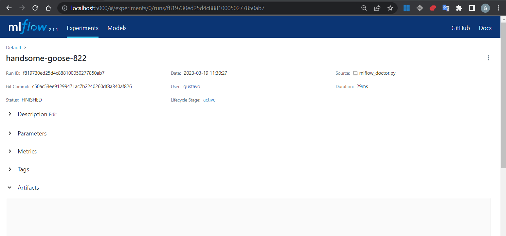

# Optimizing Your Machine Learning Workflow with MLFlow, Docker and Azure. Part 1 - An Overview of MLFlow
[Go to Root Index](../README.md)

MLFlow is an open-source platform for managing the machine learning lifecycle. It simplifies the process of building, training, and deploying machine learning models by providing a unified framework for tracking experiments, packaging code, and sharing models.

In this article:

- [1. The promise](#1-the-promise)
- [2. Core components](#2-core-components)
- [3. Requirements and recommendations](#3-requirements-and-recommendations)
- [4. MLflow system pip install & UI run](#4-mlflow-system-pip-install--ui-run)
    - [4.1 System MLflow setup](#41-system-mlflow-setup)
    - [4.2 Conda env MLflow setup](#42-conda-env-mlflow-setup)
    - [4.3 MLflow Tracking UI run](#43-mlflow-tracking-ui-run)
- [5. First MLFlow run with `mlflow.doctor()`](#5-first-mlflow-run-with-mlflowdoctor)
- [6. Logging runs with MLflow Tracking](#6-logging-runs-with-mlflow-tracking)
    - [6.1 Basic ML Sample App using the Tracking API](#61-basic-ml-sample-app-using-the-tracking-api)
    - [6.2 Running the mlflow_tracking.py example (Scenario 1)](#62-running-the-mlflow_trackingpy-example-scenario-1)
    - [6.3 Tracked data folders](#63-tracked-data-folders)
    - [6.4 Viewing the tracked data using the Tracking UI](#64-viewing-the-tracked-data-using-the-tracking-ui)

## 1. The promise
[Go to Index](#optimizing-your-machine-learning-workflow-with-mlflow-docker-and-azure-part-1---an-overview-of-mlflow)

The use of MLFlow can help data scientists work more effectively and efficiently, while also improving the reproducibility and collaboration of machine learning projects. By providing a centralized platform for managing machine learning projects and models, MLFlow can help data scientists spend less time on administrative tasks and more time on solving business problems:

- **Reproducibility**: One of the biggest challenges in machine learning is reproducing results. MLFlow can help data scientists achieve reproducibility by providing a way to track and manage experiments, including parameters, code versions, and data versions.

- **Collaboration**: Data science projects often involve collaboration between multiple team members, including data scientists, data engineers, and business stakeholders. MLFlow provides a centralized platform for managing machine learning projects, making it easier for team members to collaborate and share information.

- **Model management**: MLFlow provides a way to manage machine learning models throughout their entire lifecycle, from development to deployment. This can help data scientists keep track of different versions of a model, track performance metrics, and manage model deployment.

- **Efficiency**: MLFlow can help data scientists work more efficiently by automating many of the repetitive tasks associated with machine learning, such as managing experiments and tracking model performance. This can free up time for data scientists to focus on more high-level tasks, such as feature engineering and model selection.


## 2. Core components
[Go to Index](#optimizing-your-machine-learning-workflow-with-mlflow-docker-and-azure-part-1---an-overview-of-mlflow)

At its core, MLFlow consists of three components:

- **Tracking**: Allows you to track experiments and compare the performance of different runs. You can log parameters, metrics, and artifacts (such as model checkpoints) for each run, and view them in a centralized UI.

- **Projects**: Enables you to package your code into reusable projects with a consistent structure. You can specify the dependencies, entry points, and parameters for your projects, and easily run them on different environments (such as your local machine or a remote server).

- **Models**: Helps you to package and deploy your models in a standardized format. You can register models with versioned names, add metadata (such as the model's performance metrics), and deploy them to different deployment targets (such as a REST API or a serverless function).

MLFlow is language-agnostic, which means you can use it with any programming language and machine learning framework. It supports popular frameworks like TensorFlow, PyTorch, Scikit-Learn, and XGBoost, as well as cloud platforms like AWS, Azure, and GCP.

In summary, MLFlow provides a simple and scalable way to manage your machine learning projects. It helps you to keep track of your experiments, organize your code, and deploy your models in a reproducible and standardized way. If you're looking to streamline your machine learning workflow and collaborate with other data scientists, MLFlow is definitely worth checking out!


## 3. Requirements and recommendations
[Go to Index](#optimizing-your-machine-learning-workflow-with-mlflow-docker-and-azure-part-1---an-overview-of-mlflow)

To use MLFlow, you will need to meet some basic requirements, which include:

- Install **Python**: MLFlow runs on Python, so you will need to have Python installed on your system. MLFlow is compatible with Python 3.5 or higher.
- Install a **development environment**: You can use any development environment you like, such as Jupyter Notebook, PyCharm, or Visual Studio Code. The last is my personal preference, and you will see several captures of it in this article.
- Install **machine learning libraries**: Depending on the machine learning frameworks you want to use with MLFlow, you will need to install the corresponding libraries, such as TensorFlow, PyTorch, or Scikit-Learn.
- Install **MLFlow**: You can install MLFlow using the pip package manager. Once installed, you can use the MLFlow command-line interface to create projects, run experiments, and manage your models.

In addition to these basic requirements, it is also recommended:

- **Conda** as the tool for managing the Python development environment in which MLFlow is pip installed.
- Some knowledge of **Python programming**, and
- **ML** model/projects lifecycle management.


## 4. MLflow system pip install & UI run

As usual, you can install MLFlow together with your system python (not advisable, mostly for container deployments), in a folder in your local project folder (with venv or similar) or in a shared and isolated folder with conda.

### **4.1 System MLflow setup**
[Go to Index](#optimizing-your-machine-learning-workflow-with-mlflow-docker-and-azure-part-1---an-overview-of-mlflow)

Install MLflow from `PyPI` via:

```bash
$ pip install mlflow
```

You can install MLflow with extra ML libraries and 3rd-party tools too:

```bash
$ pip install mlflow[extras]
```

Or you can install a lower dependency subset of MLflow from `PyPI` via:

```bash
$ pip install mlflow-skinny
```

### **4.2 Conda env MLflow setup**
[Go to Index](#optimizing-your-machine-learning-workflow-with-mlflow-docker-and-azure-part-1---an-overview-of-mlflow)

In your terminal, `pip install mlflow` as before, but this time with a new `mlflow` conda env created  activated:

```bash
$ conda create -n mlflow python=3.10
$ conda activate mlflow
(mlflow)$
(mlflow)$ pip install mlflow
```

Or using a conda yaml file:

```bash
$ conda env create --name mlflow --file=conda.yaml
$ conda activate mlflow
(mlflow)$
```

Where the `conda.yaml` file is something like:

```yaml
channels:
- conda-forge
dependencies:
- python=3.10.9
- pip<=22.3.1
- pip:
  - mlflow[extras]<3,>=2.1
name: mlflow

```

### **4.3 MLflow Tracking UI run**
[Go to Index](#optimizing-your-machine-learning-workflow-with-mlflow-docker-and-azure-part-1---an-overview-of-mlflow)

After installed and with the conda env activated, you can run MLflow’s Tracking UI with `mlflow ui`:

```
(mlflow)$ mlflow ui
[2023-02-24 10:48:08 +0100] [6330] [INFO] Starting gunicorn 20.1.0
[2023-02-24 10:48:08 +0100] [6330] [INFO] Listening at: http://127.0.0.1:5000 (6330)
[2023-02-24 10:48:08 +0100] [6330] [INFO] Using worker: sync
[2023-02-24 10:48:08 +0100] [6331] [INFO] Booting worker with pid: 6331
[2023-02-24 10:48:08 +0100] [6332] [INFO] Booting worker with pid: 6332
[2023-02-24 10:48:08 +0100] [6333] [INFO] Booting worker with pid: 6333
[2023-02-24 10:48:08 +0100] [6334] [INFO] Booting worker with pid: 6334
```

View it in your browser at: [http://localhost:5000](http://localhost:5000)

You can finish the `mlflow ui` execution with `ctrl^c` at any time. For the moment let this terminal running and open another terminal to follow with the article.


## 5. First MLFlow run with `mlflow.doctor()`
[Go to Index](#optimizing-your-machine-learning-workflow-with-mlflow-docker-and-azure-part-1---an-overview-of-mlflow)

With the default MLFlow configuration, wherever you run your machine learning program, the tracking API will write all tracked data in files into a local `./mlruns` directory. Let's track this data in our own `project/poc` folder.

Create your `project/poc` folder, and `cd` into it. You can also clone the companion repo for this article, an make a copy of this `1_MLFlow_on_localhost_Basic_Install` repo folder. I will refer to it as `poc1` to abbreviate.

```bash
$ cd poc1
$ tree .
.
├── README.md
├── conda.yaml
├── examples
│   └── quickstart
│       └── mlflow_tracking.py
├── images
│   ├── mlflow_ui_run_detail.png
│   └── mlflow_ui_run_list.png
└── mlflow_doctor.py
```

Our first MLFlow run will be carried out by `mlflow_doctor.py`:

```python
import mlflow

with mlflow.start_run():
    mlflow.doctor()
```

`mlflow.doctor()` function quickly check your `mlflow` install. When we call it, it returns something like:

```bash
(mlflow)$ python mlflow_doctor.py
System information: Linux #1 SMP Fri Jan 27 02:56:13 UTC 2023
Python version: 3.10.9
MLflow version: 2.1.1
MLflow module location: /home/gustavo/miniconda3/envs/mlflow/lib/python3.10/site-packages/mlflow/__init__.py
Tracking URI: file:///home/gustavo/training/Training.MLOps.MLFlow/1_MLFlow_on_localhost_Basic_Install/mlruns
Registry URI: file:///home/gustavo/training/Training.MLOps.MLFlow/1_MLFlow_on_localhost_Basic_Install/mlruns
Active experiment ID: 0
Active run ID: f819730ed25d4c888100050277850ab7
Active run artifact URI: file:///home/gustavo/training/Training.MLOps.MLFlow/1_MLFlow_on_localhost_Basic_Install/mlruns/0/f819730ed25d4c888100050277850ab7/artifacts
MLflow dependencies:
  Flask: 2.2.3
  Jinja2: 3.1.2
  alembic: 1.9.4
  click: 8.1.3
  cloudpickle: 2.2.1
  databricks-cli: 0.17.4
  docker: 6.0.1
  entrypoints: 0.4
  gitpython: 3.1.31
  gunicorn: 20.1.0
  importlib-metadata: 5.2.0
  markdown: 3.4.1
  matplotlib: 3.7.0
  numpy: 1.23.5
  packaging: 23.0
  pandas: 1.5.3
  protobuf: 4.22.0
  pyarrow: 10.0.1
  pytz: 2022.7.1
  pyyaml: 6.0
  querystring-parser: 1.2.4
  requests: 2.28.2
  scikit-learn: 1.2.1
  scipy: 1.10.1
  shap: 0.41.0
  sqlalchemy: 1.4.46
  sqlparse: 0.4.3

3 directories, 6 files

(mlflow)$
```

Observe how our folder tree has changed:

```bash
(mlflow) tree .
.
├── README.md
├── conda.yaml
├── examples
│   └── quickstart
│       └── mlflow_tracking.py
├── images
│   ├── ...
├── mlflow_doctor.py
└── mlruns                                         # <-- Created
    └── 0
        ├── f819730ed25d4c888100050277850ab7
        │   ├── artifacts
        │   ├── meta.yaml
        │   ├── metrics
        │   ├── params
        │   └── tags
        │       ├── mlflow.runName
        │       ├── mlflow.source.git.commit
        │       ├── mlflow.source.name
        │       ├── mlflow.source.type
        │       └── mlflow.user
        └── meta.yaml

10 directories, 13 files

(mlflow)$
```

To check everything is ok, MLFlow doctor has created a first dummy run for us. If you update the MLFlow UI page running in the browser, we can navigate the former folder tree, and get the details of that run.


<p align='left'>
    
</p>

Click on the first run "handsome-goose-822" to get all run tracked info. For the moment that track is empty:

<p align='left'>
    
</p>


## 6. Logging runs with MLflow Tracking

### **6.1 Basic ML Sample App using the Tracking API**
[Go to Index](#optimizing-your-machine-learning-workflow-with-mlflow-docker-and-azure-part-1---an-overview-of-mlflow)

MLflow Tracking API basic usage is as follows:

```python
import mlflow                                           # implements the MLflow Tracking client API

with mlflow.start_run():

    # before model training:
    mlflow.log_param("layers", layers)                  # model params tracking
    mlflow.log_param("alpha", alpha)

    # train your model

    # after training:
    mlflow.log_metric("mse", model.mse())               # training metrics tracking
    mlflow.log_artifacts("plot", model.plot(test_df))   # artifacts tracking
    mlflow.tensorflow.log_model(model)                  # trained model preserved
```

**MlFlow tracking** is implemented through the use of an **MLFlow client**-**MLFlow server** pair:

- The **MLFlow client** is responsible for implementing the `log_param()`, `log_metric()`, and `log_artifacts()` function calls, which are part of the API known as the **MLflow Tracking API**.
- Depending on how the `MLFLOW_TRACKING_URL` environment variable is configured for the client, the **MLFlow client** may optionally communicate with the **MLFlow server**.

The sample code provided utilizes the **MLflow Tracking API** to store logged tracking data:

- By default, the tracking data is stored locally in the `./mlruns` folder (referred to as scenario 1 in the MLFlow documentation), i.e. the `MLFLOW_TRACKING_URL` environment variable is set to `./mlruns` by default.
- The default configuration of the `MLFLOW_TRACKING_URL` environment variable can be changed to store the data in the `mlruns.db` SQLite database file (referred to as scenario 2).
- When a tracking server URL is defined by the `MLFLOW_TRACKING_URL` environment variable, the tracking data can be stored locally or remotely, depending on the scenario (referred to as scenarios 3-6). The MLFLOW_TRACKING_URL environment variable may be set to something like `http://localhost:5000` or `http://your/remote/host:5000`. The tracking server can be run locally or remotely, and the tracking data stored by it can also be local or remote.

In addition to using the `MLFLOW_TRACKING_URL` environment variable, you can also modify the MLFlow tracking URI by using the MLflow Tracking client API call `mlflow.set_tracking_uri()`.


### **6.2 Running the `mlflow_tracking.py` example (Scenario 1)**
[Go to Index](#optimizing-your-machine-learning-workflow-with-mlflow-docker-and-azure-part-1---an-overview-of-mlflow)

The `mlflow_tracking.py` example code is as follows:

```python
import os
from random import random, randint
from mlflow import set_tracking_uri, get_tracking_uri, log_metric, log_param, log_artifacts

if __name__ == "__main__":

    set_tracking_uri("./mlruns")                          # Scenario 1: we set here its default value, just for clarity

    tracking_uri = get_tracking_uri()
    print("Current tracking uri: {}".format(tracking_uri))

    # Log a parameter (key-value pair)
    log_param("param1", randint(0, 100))

    # Log a metric; metrics can be updated throughout the run
    log_metric("foo", random())
    log_metric("foo", random() + 1)
    log_metric("foo", random() + 2)

    # Log an artifact (output file)
    if not os.path.exists("outputs"):
        os.makedirs("outputs")
    with open("outputs/test.txt", "w") as f:
        f.write("hello world!")
    log_artifacts("outputs")
```

Move to your first terminal, and run the former example with:

```bash
$ conda activate mlflow
(mlflow)$
(mlflow)$ python examples/quickstart/mlflow_tracking.py
Current tracking uri: ./mlruns
(mlflow)$
```

This sample ML application utilizes the MLflow Tracking client API to log tracking data in the `./mlruns` directory.

These logs can be viewed through the Tracking UI, which is a component of the Tracking service that allows users to navigate and view all tracked data for each training run.

### **6.3 Tracked data folders**
[Go to Index](#optimizing-your-machine-learning-workflow-with-mlflow-docker-and-azure-part-1---an-overview-of-mlflow)

In this scenario 1, each tracked run data is in a guid folder under `mlruns/0`. Here `0` is the default experiment.

```
$ tree .
.
├── README.md
├── conda.yaml
├── examples
│   └── quickstart
│       └── mlflow_tracking.py
├── images
│   ├── ...
├── mlflow_doctor.py
├── mlruns
│   ├── 0                                        # Experiment Id: 0                         --> Default Experiment
│   │   ├── 176cb304d9c34a559a50fd34e3ffd0dc     # Run Id: 176cb304d9c34a559a50fd34e3ffd0dc --> masked-show-660
│   │   │   ├── artifacts
│   │   │   │   └── test.txt
│   │   │   ├── meta.yaml
│   │   │   ├── metrics
│   │   │   │   └── foo
│   │   │   ├── params
│   │   │   │   └── param1
│   │   │   └── tags
│   │   │       ├── mlflow.runName
│   │   │       ├── mlflow.source.git.commit
│   │   │       ├── mlflow.source.name
│   │   │       ├── mlflow.source.type
│   │   │       └── mlflow.user
│   │   ├── f819730ed25d4c888100050277850ab7    # Run Id: f819730ed25d4c888100050277850ab7 --> handsome-goose-822
│   │   │   ├── artifacts
│   │   │   ├── meta.yaml
│   │   │   ├── metrics
│   │   │   ├── params
│   │   │   └── tags
│   │   │       ├── mlflow.runName
│   │   │       ├── mlflow.source.git.commit
│   │   │       ├── mlflow.source.name
│   │   │       ├── mlflow.source.type
│   │   │       └── mlflow.user
│   │   └── meta.yaml
│   └── models
└── outputs                                     # Temporal artifacts store
    └── test.txt

17 directories, 27 files
```

### **6.4 Viewing the tracked data using the Tracking UI**
[Go to Index](#optimizing-your-machine-learning-workflow-with-mlflow-docker-and-azure-part-1---an-overview-of-mlflow)

The Tracking UI is a website that navigates all tracked data and artifacts, that as you know, in this Scenario 1 are under the `./mlruns` folder.

Run the Tracking UI with:

```bash
$ export MLFLOW_TRACKING_URL="./mlruns"   # ./mlruns is the default value, and we don't really need to set it again
$ mlflow ui --port 5000                   # port 5000 is the default port, and we don't really need to set it again
```

Now in your web browser open: [http://localhost:5000](http://localhost:5000)

<p align='left'>
    
</p>

> **Note:**
>
> Initially, all runs are grouped under the Default experiment. You can optionally group runs into new experiments, having together all runs for a specific task.
>
> You can create an experiment using the MLFlow UI web app or in your code with the mlflow.create_experiment() API function.
>
> Additionaly, you can use the `mlflow experiments` CLI command, using the corresponding REST parameters.

Both, MLflow API and MLFlow UI, will let you search for experiments and runs too.

You can get the last run details clicking at `masked-show-660`:

<p align='left'>
    
</p>

## 7. Summary

As you can see, installing and setting up MLFlow is straightforward through pip and conda. It includes a comprehensive UI for tracking experiments and runs, which is easy to launch. To quickly check the setup, you can perform a dummy run using the mlflow.doctor() function. You can find your first basic ML Sample App instrumented for the Tracking API in the GitHub repository for this article.

In summary, MLFlow is a powerful tool that simplifies the workflow in Machine Learning. Its user-friendly interface and core components allow Data Scientists and ML engineers to collaborate easily, track and manage their Machine Learning projects, streamline workflows, save time, and improve the overall quality of their work.