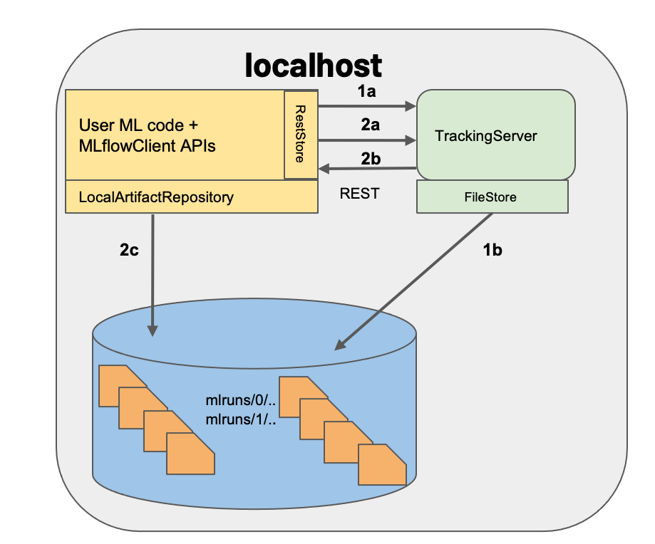

# 2. MLFlow Backend and Artifact Storage. Scenarios 1, 2 and 3
[Go to Root Index](../README.md)

- [1. Introduction](./README.md#1-introduction)
- [2. Scenario 1: MLFlow Client tracking. No HTTP Tracking server. ('MLFLOW_TRACKING_URI="file:///tmp/my_tracking"')](./README.md#2-scenario-1-mlflow-client-tracking-no-http-tracking-server-mlflow_tracking_urifiletmpmy_tracking)
  - [2.1 Set the MLFlow Client's 'Backend store' and 'Artifacts store'](./README.md#21-set-the-mlflow-clients-backend-store-and-artifacts-store)
  - [2.2 Launch the 'mlflow UI' server](./README.md#22-launch-the-mlflow-ui-server)
  - [2.3 The 'quickstart' example under Scenario 1](./README.md#23-the-quickstart-example-under-scenario-1)
- [3. Scenario 2: MLFlow Client tracking. No HTTP Tracking server. ('MLFLOW_TRACKING_URI="sqlite:///mlruns.db"')](./README.md#3-scenario-2-mlflow-client-tracking-no-http-tracking-server-mlflow_tracking_urisqlitemlrunsdb)
  - [3.1 Set the MLFlow Client's 'Backend store' in a local SQLite database and 'Artifacts store' in a local folder](./README.md#31-set-the-mlflow-clients-backend-store-in-a-local-sqlite-database-and-artifacts-store-in-a-local-folder)
  - [3.2 Launch the 'mlflow UI' server](./README.md#32-launch-the-mlflow-ui-server)
  - [3.3 The 'quickstart' example under Scenario 2](./README.md#33-the-quickstart-example-under-scenario-2)
- [4. Scenario 3: MLFlow Client + Server  tracking ('MLFLOW_TRACKING_URI="http://localhost:5003"')](./README.md#4-scenario-3-mlflow-client--http-tracking-server-mlflow_tracking_urihttplocalhost5003)
  - [4.1 Set HTTP Tracking server's 'Backend store' and the MLFlow Client's 'Artifacts store' locally](./README.md#41-set-http-tracking-servers-backend-store-and-the-mlflow-clients-artifacts-store-locally)
  - [4.2 Launch a new local MLFlow Tracking server (Scenario 3b)](./README.md#42-launch-a-new-local-mlflow-tracking-server-scenario-3b)
  - [4.3 The 'quickstart' example  under Scenario 3b](./README.md#43-the-quickstart-example-under-scenario-3b)
- [5. Execute the 'Palmer pinguins' example under Scenario 3b](./README.md#5-execute-the-palmer-pinguins-example-under-scenario-3b)
  - [5.1 Notebook 1_Run_and_track_experiments.ipynb](./README.md#51-notebook-1_run_and_track_experimentsipynb)
  - [5.2 Notebook 2_Deploy_and_manage.ipynb](./README.md#52-notebook-2_deploy_and_manageipynb)
  - [5.3 Notebook 3_Tips_and_tricks.ipynb](./README.md#53-notebook-3_tips_and_tricksipynb)

You can access the article code on the following GitHub repository::

[https://github.com/ghernantes/Training.MLOps.MLFlow/blob/main/2_MLFlow_Backend_and_Artifact_Storage_Scenarios_1_2_and_3](https://github.com/ghernantes/Training.MLOps.MLFlow/blob/main/2_MLFlow_Backend_and_Artifact_Storage_Scenarios_1_2_and_3)

## 1. Introduction
[Go to Index](#2-mlflow-backend-and-artifact-storage-scenarios-1-2-and-3)

MlFlow is implemented by means of an **MLFlow client-server** pair. This architecture is designed to provide a scalable and efficient way of managing machine learning workflows. The **server** provides a centralized location for storing and managing **experiment data**, **model artifacts**, and other resources, while the **client** provides a **command-line interface** (CLI) and **API** for interacting with the server. This separation of concerns allows for multiple users and teams to **collaborate** on machine learning projects, while ensuring that all data and resources are **securely** managed and accessible. Additionally, the client-server architecture provides a flexible framework for **integrating** MlFlow with other tools and services, enabling users to **build end-to-end machine learning pipelines** that incorporate multiple stages of model development, testing, and deployment.

Specifically, in [part 1 of this series of articles](../1_MLFlow_Install_and_Hello_World/README.md#61-basic-ml-sample-app-using-the-tracking-api) we have already make use of:
- The **MLFlow client** implements the `log_param(), log_metric() and log_artifacts()` function calls we have seen . These functions are part of the API known as the **MLflow Tracking API**.
- The **MLFlow client** can then **optionally** communicate to the **MLFlow server**, depending on how the env variable `MLFLOW_TRACKING_URL` is configured for the client.

MLFlow also offers two storage components: the **Backend store** and the **Artifact store**. The backend store persists MLFlow entities like runs, parameters, metrics, and metadata, while the artifact store stores artifacts such as files, models, images, and in-memory objects. The `AbstractStore` and `ArtifactRepository` are the respective abstract classes that define how to work with these stores. The `FileStore`, `RestStore`, and `SQLAlchemyStore` are examples of concrete implementations of the `AbstractStore` class, while the `LocalArtifactRepository`, `AzureBlobArtifactRepository`, and `S3ArtifactRepository` are concrete implementations of the `ArtifactRepository` class:

- The **Backend store**:
  - persists MLFlow entities (runs, parameters, metrics, tags, notes, metadata, etc)
  - implementation:
    - `AbstractStore` abstract class .
    - `FileStore`, `RestStore`, and `SQLAlchemyStore` are concrete implementations of the abstract class `AbstractStore`.
- The **Artifact store**:
  - persists artifacts (files, models, images, in-memory objects, or model summary, etc)
  - implementation:
    - `ArtifactRepository`abstract class .
    - `LocalArtifactRepository`, `AzureBlobArtifactRepository` and `S3ArtifactRepository` are concrete implementations of the abstract class `ArtifactRepository`.

Depending on how you configure the storage of your MLFlow client and/or server instances, you will have several scenarios. In this article/lab, you can practice the 3 most basic scenarios. To do that, create your own `project/poc` folder, and `cd` into it. I recommend that you make a copy of the [2_MLFlow_Backend_and_Artifact_Storage_Scenarios_1_2_and_3 repository folder](https://github.com/ghernantes/Training.MLOps.MLFlow/tree/main/2_MLFlow_Backend_and_Artifact_Storage_Scenarios_1_2_and_3) and follow along with the article's hands-on exercises. For brevity, I will refer to the copied folder as **`lab2`**.

Open three different terminals under `lab2`:

- Terminal 1: to inspect folder contents
- Terminal 2: to run mlflow servers
- Terminal 3: to run experiments

Let's inspect `lab2` folder. On **terminal 1** under `lab2`, run `tree .`:

```bash
$ tree .
.
├── .secrets
│   ├── env-secrets
│   ├── mysql-mlflowuser-password.txt
│   └── mysql-root-password.txt
├── examples
│   ├── quickstart
│   │   ├── img
│   │   │   ├── ...
│   │   └── mlflow_tracking.py
│   └── palmer_pinguins
│       ├── data
│       │   └── penguins_classification.csv
│       ├── img
│       │   ├── ...
│       └── notebooks
│           ├── 1_Run_and_track_experiments.ipynb
│           ├── 2_Deploy_and_manage.ipynb
│           └── 3_Tips_and_tricks.ipynb
├── mlflow
│   ├── .dockerignore
│   ├── conda.yml
│   ├── Dockerfile
│   ├── Dockerfile-conda
│   ├── entrypoint-conda-dev.sh
│   ├── entrypoint-pip-dev.sh
│   ├── entrypoint.sh
│   └── requirements.txt
├── .env
├── .gitignore
├── docker-compose.yml
├── README.md
├── show_all.sh
├── stack_deploy.sh
└── stack_remove.sh
```

We have two examples:

- **Quickstart**: a very simple ML modular example.
- **Palmer Pinguins**: an ML notebook example.

Let's run first the Quickstar example under those three basic scenarios:

- **Scenario 1**: client tracking on folders: with `MLFLOW_TRACKING_URI="./mlruns"` (No HTTP Tracking server)
- **Scenario 2**: client tracking on database, such as SQLite: with `MLFLOW_TRACKING_URI="sqlite:///mlruns.db"` (No HTTP Tracking server)
- **Scenario 3**: server tracking on folders/database: with `MLFLOW_TRACKING_URI="http://localhost:5000"')

## 2. Scenario 1: MLFlow Client tracking. No HTTP Tracking server. ('MLFLOW_TRACKING_URI="file:///tmp/my_tracking"')
[Go to Index](#2-mlflow-backend-and-artifact-storage-scenarios-1-2-and-3)

In this scenario:

- The **MLFlow client** directly interfaces with an instance of a `FileStore` and `LocalArtifactRepository`
- Both, **backend store** and **artifact store**, share a directory on the (local) filesystem: `./mlruns`, and


### **2.1 Set the MLFlow Client's 'Backend store' and 'Artifacts store'**
[Go to Index](#2-mlflow-backend-and-artifact-storage-scenarios-1-2-and-3)

To set your backend and artifacts stores locally, use:

- relative paths such as: `mlflow.set_tracking_uri("./mlruns)`
- in general, you can use: `mlflow.set_tracking_uri("file:///tmp/my_tracking")`, as for example: `mlflow.set_tracking_uri("file://$PWD/mlruns")`

```python
import os
from random import random, randint
from mlflow import set_tracking_uri, get_tracking_uri, log_metric, log_param, log_artifacts

if __name__ == "__main__":
    set_tracking_uri("./mlruns")                  # You specify a file store backend as './path_to_store' relative path or 'file:///path_to_store' full path
                                                  # Default is './mlruns'. Used as backend store and artifacts store. You can use 'file://$PWD/mlruns' too.
...
```
More info at: https://mlflow.org/docs/latest/tracking.html#scenario-1-mlflow-on-localhost

### **2.2 Launch the 'mlflow UI' server**
[Go to Index](#2-mlflow-backend-and-artifact-storage-scenarios-1-2-and-3)

We can launch locally the mlflow UI server with:

```bash
$ mlflow ui --port 5001
```

This launches a **'MLFlow UI server'** at http://127.0.0.1:5001 with the following default backend and artifact store configuration:

```bash
mlflow ui --backend-store-uri ./mlruns --default-artifact-root ./mlruns--host 0.0.0.0 --port 5001
```

Go to **terminal 2**, move under `lab2/mlflow` folder and type:

```bash
$ conda activate mlflow
(mlflow)$
(mlflow)$ cd mlflow
(mlflow)$ mlflow ui --port 5001
[2023-03-26 19:15:31 +0200] [1648126] [INFO] Starting gunicorn 20.1.0
[2023-03-26 19:15:31 +0200] [1648126] [INFO] Listening at: http://127.0.0.1:5001 (1648126)
[2023-03-26 19:15:31 +0200] [1648126] [INFO] Using worker: sync
[2023-03-26 19:15:31 +0200] [1648164] [INFO] Booting worker with pid: 1648164
[2023-03-26 19:15:31 +0200] [1648165] [INFO] Booting worker with pid: 1648165
[2023-03-26 19:15:31 +0200] [1648166] [INFO] Booting worker with pid: 1648166
[2023-03-26 19:15:31 +0200] [1648167] [INFO] Booting worker with pid: 1648167
```

Open our initial **terminal 1** under the `lab2` and run `tree .`:

```bash
$ tree .
.
├── README.md
├── docker-compose.yml
├── examples
│   ├── palmer_pinguins
│   │   ├── data
│   │   │   └── penguins_classification.csv
│   │   ├── img
│   │   │   ├── ...
│   │   └── notebooks
│   │       ├── 1_Run_and_track_experiments.ipynb
│   │       ├── 2_Deploy_and_manage.ipynb
│   │       └── 3_Tips_and_tricks.ipynb
│   └── quickstart
│       ├── img
│       │   ├── ...
│       └── mlflow_tracking.py
├── mlflow
│   ├── Dockerfile
│   ├── Dockerfile-conda
│   ├── conda.yml
│   ├── entrypoint-conda-dev.sh
│   ├── entrypoint-pip-dev.sh
│   ├── entrypoint.sh
│   ├── mlruns                <- This folder is created
│   │   ├── 0
│   │   │   └── meta.yaml
│   │   └── models
│   └── requirements.txt
├── show_all.sh
├── stack_deploy.sh
└── stack_remove.sh

11 directories, 53 files
```

Observe how the `mlruns` folder is created under `mlflow`.

Under `mlruns` we have the 'Default' experiment (folder 0) and no runs.

```bash
$ tree mlflow
mlflow
├── ..
├── examples
│   └── quickstart
└── requirements.txt
```

This `mlruns` folder is now monitored by our running **'MLFlow UI server'** running on **terminal 2**, and published on [http://localhost:5001](http://localhost:5001).


### **2.3 The 'quickstart' example under Scenario 1**
[Go to Index](#2-mlflow-backend-and-artifact-storage-scenarios-1-2-and-3)

Move to **terminal 3**, activate the `mlflow` conda env, cd under `lab2/mlflow` folder and run `mlflow_tracking.py`:

```bash
$ conda activate mlflow
(mlflow)$
(mlflow)$ export MLFLOW_TRACKING_URI="./mlruns"
(mlflow)$ python ../examples/quickstart/mlflow_tracking.py
Current tracking uri: ./mlruns
2023/03/26 19:17:05 INFO mlflow.tracking.fluent: Experiment with name 'quickstar' does not exist. Creating a new experiment.
Current working directory: /home/gustavo/training/GitHub/Training.MLOps.MLFlow/2_MLFlow_Backend_and_Artifact_Storage_Scenarios_1_2_and_3/mlflow
Temporal directory 'examples/quickstart/outputs' created
Artifacts in 'examples/quickstart/outputs' tracked!
Temporal directory 'examples/quickstart/outputs' has been removed successfully
```

In this simple scenario, the MLFlow client uses the following interfaces to record MLFlow entities and artifacts:

- An instance of a `FileStore` (to save MLFlow entities)
- An instance of a `LocalArtifactRepository` (to store artifacts)

Now, our `lab2/mlflow/mlruns` has a new experiment `395173098808783198` and a new run `d918463610894225b2c5d3856ba06870`.

Move to the **terminal 1** under `lab2` and this time run `tree mlflow`:

```bash
$ tree mlflow

mlflow
├── ...
└── mlruns
    ├── 0
    │   └── meta.yaml
    ├── 395173098808783198
    │   ├── d918463610894225b2c5d3856ba06870
    │   │   ├── artifacts
    │   │   │   └── test.txt
    │   │   ├── meta.yaml
    │   │   ├── metrics
    │   │   │   └── foo
    │   │   ├── params
    │   │   │   └── param1
    │   │   └── tags
    │   │       ├── mlflow.runName
    │   │       ├── mlflow.source.git.commit
    │   │       ├── mlflow.source.name
    │   │       ├── mlflow.source.type
    │   │       └── mlflow.user
    │   └── meta.yaml
    └── models
```

Have a look at the **'MLFlow UI server'** to see how it played out!


Tracked parameters and metrics are easy to inspect. Artifacts can be inspected and downloaded too. All information is organized around a clean and usable interface, grouped by experiments and runs.

## 3. Scenario 2: MLFlow Client tracking. No HTTP Tracking server. (`MLFLOW_TRACKING_URI="sqlite:///mlruns.db"`)
[Go to Index](#2-mlflow-backend-and-artifact-storage-scenarios-1-2-and-3)

In this scenario:

- The **MLFlow client** directly interfaces with:
  - an instance of a `SQLAlchemyStore`.
      - **Backend store**: MLFlow entities are inserted in a (local) SQLite database file `mlruns.db`
  - an instance of `LocalArtifactRepository`.
      - **Artifact store**: artifacts are stored under the (local) `./mlruns` directory


### **3.1 Set the MLFlow Client's 'Backend store' in a local SQLite database and 'Artifacts store' in a local folder**
[Go to Index](#2-mlflow-backend-and-artifact-storage-scenarios-1-2-and-3)

To set your backend and artifacts stores:

- Instrument your training code by using: `mlflow.set_tracking_uri("sqlite:///mlruns.db")`

 ```python
 import os
 from random import random, randint
 from mlflow import set_tracking_uri, get_tracking_uri, log_metric, log_param, log_artifacts

 if __name__ == "__main__":
     set_tracking_uri("sqlite:///mlruns.db")   # backend store: SQLite database local file ./mlruns.db
                                               # artifacts store: artifacts are stored under the local ./mlruns directory
 ...
 ```
- Alternativelly, set and export the environment variable: `MLFLOW_TRACKING_URI="sqlite:///mlruns.db"` where the training code is executed.

You specify a database-backed store as SQLAlchemy database URI. The database SQLAlchemy URI typically takes the format:

`<dialect>+<driver>://<username>:<password>@<host>:<port>/<database>`

- dialect: MLFlow supports the database dialects mysql, mssql, sqlite, and postgresql.
- driver: is optional. If you do not specify a driver, SQLAlchemy uses a dialect’s default driver.

More info at: https://mlflow.org/docs/latest/tracking.html#scenario-2-mlflow-on-localhost-with-sqlite


### **3.2 Launch the 'mlflow UI' server**
[Go to Index](#2-mlflow-backend-and-artifact-storage-scenarios-1-2-and-3)

We can launch locally the mlflow UI server with:

```bash
$ mlflow ui --backend-store-uri sqlite:///mlruns.db --port 5002
```

This launches an **'MLFlow UI server'** at http://127.0.0.1:5002 with the following **'MLFlow Client'** backend and artifact store configuration.

```bash
$ mlflow ui --backend-store-uri sqlite:///mflow.db --default-artifact-root ./mlruns --host 0.0.0.0 --port 5002
```

Open **terminal 2** and check if other `mlflow ui` process is still running under `lab2/mlflow`.

Stop that service (`Ctrl+c`) and run:

```bash
$ mlflow ui --backend-store-uri sqlite:///mflow.db --port 5002
2023/03/26 19:26:40 INFO mlflow.store.db.utils: Creating initial MLflow database tables...
2023/03/26 19:26:40 INFO mlflow.store.db.utils: Updating database tables
INFO  [alembic.runtime.migration] Context impl SQLiteImpl.
INFO  [alembic.runtime.migration] Will assume non-transactional DDL.
INFO  [alembic.runtime.migration] Running upgrade  -> 451aebb31d03, add metric step
INFO  [alembic.runtime.migration] Running upgrade 451aebb31d03 -> 90e64c465722, migrate user column to tags
INFO  [alembic.runtime.migration] Running upgrade 90e64c465722 -> 181f10493468, allow nulls for metric values
INFO  [alembic.runtime.migration] Running upgrade 181f10493468 -> df50e92ffc5e, Add Experiment Tags Table
INFO  [alembic.runtime.migration] Running upgrade df50e92ffc5e -> 7ac759974ad8, Update run tags with larger limit
INFO  [alembic.runtime.migration] Running upgrade 7ac759974ad8 -> 89d4b8295536, create latest metrics table
INFO  [89d4b8295536_create_latest_metrics_table_py] Migration complete!
INFO  [alembic.runtime.migration] Running upgrade 89d4b8295536 -> 2b4d017a5e9b, add model registry tables to db
INFO  [2b4d017a5e9b_add_model_registry_tables_to_db_py] Adding registered_models and model_versions tables to database.
INFO  [2b4d017a5e9b_add_model_registry_tables_to_db_py] Migration complete!
INFO  [alembic.runtime.migration] Running upgrade 2b4d017a5e9b -> cfd24bdc0731, Update run status constraint with killed
INFO  [alembic.runtime.migration] Running upgrade cfd24bdc0731 -> 0a8213491aaa, drop_duplicate_killed_constraint
INFO  [alembic.runtime.migration] Running upgrade 0a8213491aaa -> 728d730b5ebd, add registered model tags table
INFO  [alembic.runtime.migration] Running upgrade 728d730b5ebd -> 27a6a02d2cf1, add model version tags table
INFO  [alembic.runtime.migration] Running upgrade 27a6a02d2cf1 -> 84291f40a231, add run_link to model_version
INFO  [alembic.runtime.migration] Running upgrade 84291f40a231 -> a8c4a736bde6, allow nulls for run_id
INFO  [alembic.runtime.migration] Running upgrade a8c4a736bde6 -> 39d1c3be5f05, add_is_nan_constraint_for_metrics_tables_if_necessary
INFO  [alembic.runtime.migration] Running upgrade 39d1c3be5f05 -> c48cb773bb87, reset_default_value_for_is_nan_in_metrics_table_for_mysql
INFO  [alembic.runtime.migration] Running upgrade c48cb773bb87 -> bd07f7e963c5, create index on run_uuid
INFO  [alembic.runtime.migration] Running upgrade bd07f7e963c5 -> 0c779009ac13, add deleted_time field to runs table
INFO  [alembic.runtime.migration] Running upgrade 0c779009ac13 -> cc1f77228345, change param value length to 500
INFO  [alembic.runtime.migration] Running upgrade cc1f77228345 -> 97727af70f4d, Add creation_time and last_update_time to experiments table
INFO  [alembic.runtime.migration] Context impl SQLiteImpl.
INFO  [alembic.runtime.migration] Will assume non-transactional DDL.
[2023-03-26 19:26:40 +0200] [1698376] [INFO] Starting gunicorn 20.1.0
[2023-03-26 19:26:40 +0200] [1698376] [INFO] Listening at: http://0.0.0.0:5002 (1698376)
[2023-03-26 19:26:40 +0200] [1698376] [INFO] Using worker: sync
[2023-03-26 19:26:40 +0200] [1698377] [INFO] Booting worker with pid: 1698377
[2023-03-26 19:26:41 +0200] [1698378] [INFO] Booting worker with pid: 1698378
[2023-03-26 19:26:41 +0200] [1698379] [INFO] Booting worker with pid: 1698379
[2023-03-26 19:26:41 +0200] [1698380] [INFO] Booting worker with pid: 1698380
```

Open our initial **terminal 1** under the lab2 and run `tree mkflow`:

```bash
$ tree mkflow

mlflow
├── ...
├── mlruns
│   ├── 0
│   │   └── meta.yaml
│   ├── 395173098808783198
│   │   ├── d918463610894225b2c5d3856ba06870
│   │   │   ├── artifacts
│   │   │   │   └── test.txt
│   │   │   ├── meta.yaml
│   │   │   ├── metrics
│   │   │   │   └── foo
│   │   │   ├── params
│   │   │   │   └── param1
│   │   │   └── tags
│   │   │       ├── mlflow.runName
│   │   │       ├── mlflow.source.git.commit
│   │   │       ├── mlflow.source.name
│   │   │       ├── mlflow.source.type
│   │   │       └── mlflow.user
│   │   └── meta.yaml
│   └── models
└── mlruns.db    <- This SQLite database file is created.
```

Observe how the `mflow.db` SQLite database file has been created under the `mlflow` folder. In this Scenario 2, this database is used directly by the **MLFlow Client**, through the `SQLAlchemyStore` interface.

### **3.3 The 'quickstart' example under Scenario 2**
[Go to Index](#2-mlflow-backend-and-artifact-storage-scenarios-1-2-and-3)

Move to **terminal 3**. The `mlflow` conda env should be still activated, and the working directory should be `lab2/mlflow`.

Under this folder run `mlflow_tracking.py` again, but this time change the `MLFLOW_TRACKING_URI ` as in the following code:

```bash
$ conda activate mlflow
(mlflow)$
(mlflow)$ export MLFLOW_TRACKING_URI="sqlite:///mflow.db"
(mlflow)$
(mlflow)$ python ../examples/quickstart/mlflow_tracking.py
Current tracking uri: sqlite:///mflow.db
2023/03/26 19:32:15 INFO mlflow.tracking.fluent: Experiment with name 'quickstar' does not exist. Creating a new experiment.
Current working directory: /home/gustavo/training/GitHub/Training.MLOps.MLFlow/lab2/mlflow
Temporal directory 'examples/quickstart/outputs' created
Artifacts in 'examples/quickstart/outputs' tracked!
Temporal directory 'examples/quickstart/outputs' has been removed successfully
```

In this simple scenario, the **MLFlow Client** uses the following interfaces to record MLFlow entities and artifacts:

- An instance of a `SQLAlchemyStore` (to save MLFlow entities)
- An instance of a `LocalArtifactRepository` (to store artifacts)

Now, our `lab2/mlflow/mlruns` folder has a new experiment `1` and a new run `73b821edb9f54f82a72ec44fac9ff171`, containing the logged artifacts for that run.

Additionally, the `lab2/mlflow/mlruns.db` SQLite database file has been used to track MLFlow entities, including the parameters and metrics of that `73b821edb9f54f82a72ec44fac9ff171` run.

Move to **terminal 1** and run `tree mlflow` again:

```bash
$ tree mlflow

mlflow
├── ...
├── mlruns
│   ├── 0
│   │   └── meta.yaml
│   ├── 1
│   │   └── 73b821edb9f54f82a72ec44fac9ff171   <-- Artifacts of this last run
│   │       └── artifacts
│   │           └── test.txt
│   ├── 395173098808783198
│   │   ├── d918463610894225b2c5d3856ba06870
│   │   │   ├── artifacts
│   │   │   │   └── test.txt
│   │   │   ├── meta.yaml
│   │   │   ├── metrics
│   │   │   │   └── foo
│   │   │   ├── params
│   │   │   │   └── param1
│   │   │   └── tags
│   │   │       ├── mlflow.runName
│   │   │       ├── mlflow.source.git.commit
│   │   │       ├── mlflow.source.name
│   │   │       ├── mlflow.source.type
│   │   │       └── mlflow.user
│   │   └── meta.yaml
│   └── models
└── mlruns.db
```

Have a look at the **'MLFlow UI server'** to see how it played out!


**Note:**

Because the **MLFlow Client** is now using the `SQLAlchemyStore` interface and SQLite as Backend store, all runs performed with `FileStore` in Scenario 1 are not available in our **MLFlow UI**. To recover those runs, just launch again the ui service on **terminal 2** with:

```bash
mlflow ui
```

or

```bash
mlflow ui --backend-store-uri mlruns/ --default-artifact-root mlruns/ --host 0.0.0.0 --port 5001
```

## 4. Scenario 3: MLFlow Client + HTTP Tracking server ('MLFLOW_TRACKING_URI="http://localhost:5003"')
[Go to Index](#2-mlflow-backend-and-artifact-storage-scenarios-1-2-and-3)

In this scenario:

- The **MLFlow client** directly interfaces with:
    - an instance of `LocalArtifactRepository`.
      - the **Artifact Store** is under `./mlruns/` folder), and
    - an instance of `RestStore` to reach the **MLFlow Tracking server**

- The **MLFlow Tracking server**:
    - interfaces with (depending on the specified configuration):
      -  an instance of `FileStore`:
          - the **Backend Store** is under `./mlruns/` folder (Scenario 3a), or
      -  an instance of `SQLAlchemyStore`:
          - the **Backend Store** is in `mlruns.db` SQLite database file (Scenario 3b)
    - artifact serving is disabled (by using `--no-serve-artifacts` option)



### **4.1 Set HTTP Tracking server's 'Backend store' and the MLFlow Client's 'Artifacts store' locally**
[Go to Index](#2-mlflow-backend-and-artifact-storage-scenarios-1-2-and-3)

To set your backend and artifacts stores:

- First, tell the **MLFlow client** that will work together with an **MLFlow HTTP tracking server**:
  - Instrumenting the training code with: `mlflow.set_tracking_uri("http://my-tracking-server:5003")`
    ```python
    import os
    from random import random, randint
    from mlflow import set_tracking_uri, get_tracking_uri, log_metric, log_param, log_artifacts

    if __name__ == "__main__":
      set_tracking_uri("http://localhost:5003")            # Scenario 3
    ...
    ```
  - Or setting and exporting the environment variable: `MLFLOW_TRACKING_URI="http://localhost:5003"` where the training code is executed.

- Then, launch the **MLFlow HTTP tracking server** with:

  ```bash
  mlflow server \                               # Scenario 3a:
  --backend-store-uri ./mlruns \                # backend store: local folder under ./mlruns (see flow: 1a --> 1b)
  --default-artifact-root ./mlruns \            # artifacts store: artifacts are stored under the same local ./mlruns directory
  --no-serve-artifacts \                        # the server doesn't manage the artifact store: log_artifact() http requests are sent to the client
  --host 0.0.0.0 --port 5003                    #                                               (see flow: 2a --> 2b --> 2c)
  ```

  or:

  ```bash
  mlflow server \                               # Scenario 3b:
  --backend-store-uri sqlite:///mlruns.db \     # backend store: SQLite database local file ./mlruns.db
  --default-artifact-root ./mlruns \            # artifacts store: artifacts are stored under the local ./mlruns directory
  --no-serve-artifacts \
  --host 0.0.0.0 --port 5003
  ```

Notes:

- `--default-artifact-root` is required when backend store is not local file based and artifact serving is disabled.
- In the last case, the SQLite DB file is created for us.

More info at: https://mlflow.org/docs/latest/tracking.html#scenario-3-mlflow-on-localhost-with-tracking-server

#mlflow.set_tracking_uri("databricks://<profileName>")


### **4.2 Launch a new local MLFlow Tracking server (Scenario 3b)**
[Go to Index](#2-mlflow-backend-and-artifact-storage-scenarios-1-2-and-3)

Open **terminal 2** and stop any service (`Ctrl+c`) running under `lab2/mlflow`.

Now run:


  ```bash
  $ mlflow server --backend-store-uri sqlite:///mflow.db --default-artifact-root ./mlruns --no-serve-artifacts --host 0.0.0.0 --port 5003

  [2023-03-26 20:00:19 +0200] [1849352] [INFO] Starting gunicorn 20.1.0
  [2023-03-26 20:00:19 +0200] [1849352] [INFO] Listening at: http://0.0.0.0:5003 (1849352)
  [2023-03-26 20:00:19 +0200] [1849352] [INFO] Using worker: sync
  [2023-03-26 20:00:19 +0200] [1849353] [INFO] Booting worker with pid: 1849353
  [2023-03-26 20:00:19 +0200] [1849354] [INFO] Booting worker with pid: 1849354
  [2023-03-26 20:00:19 +0200] [1849355] [INFO] Booting worker with pid: 1849355
  [2023-03-26 20:00:19 +0200] [1849356] [INFO] Booting worker with pid: 1849356
  ```

NOTE: If `mflow.db` is still there, it will be reused. If not, the process db file creation and db contents migration is executed again.

### **4.3 The 'quickstart' example under Scenario 3b**
[Go to Index](#2-mlflow-backend-and-artifact-storage-scenarios-1-2-and-3)

Move to terminal 3. The mlflow conda env should be still activated, and the working directory should be lab2/mlflow.

Under this folder run mlflow_tracking.py again, but this time change the MLFLOW_TRACKING_URI as in the following code:

```bash
$ conda activate mlflow
(mlflow)$
(mlflow)$ export MLFLOW_TRACKING_URI="http://localhost:5003"
(mlflow)$
(mlflow)$ python ../examples/quickstart/mlflow_tracking.py
Current tracking uri: http://localhost:5003
Current working directory: /home/gustavo/training/GitHub/Training.MLOps.MLFlow/lab2/mlflow
Temporal directory 'examples/quickstart/outputs' created
Artifacts in 'examples/quickstart/outputs' tracked!
Temporal directory 'examples/quickstart/outputs' has been removed successfully
```

## 5. Execute the 'Palmer pinguins' example under Scenario 3b

### **5.1 Notebook `1_Run_and_track_experiments.ipynb`**
[Go to Index](#2-mlflow-backend-and-artifact-storage-scenarios-1-2-and-3)

Open the following notebook:

[./examples/palmer_pinguins/notebooks/1_Run_and_track_experiments.ipynb](./examples/palmer_pinguins/notebooks/1_Run_and_track_experiments.ipynb)

and execute it. You will have:

```bash
tree .
.
├── README.md
├── examples
│   ├── palmer_pinguins
│   │   ├── data
│   │   │   └── penguins_classification.csv
│   │   ├── notebooks
│   │   │   ├── 1_Run_and_track_experiments.ipynb
│   │   │   ├── 2_Deploy_and_manage.ipynb
│   │   │   └── 3_Tips_and_tricks.ipynb
│   │   └── resources
│   │       ├── culmen_depth.png
│   │       ├── mlflow_ui_pinguins_experiment_first_run_details.png
│   │       ├── mlflow_ui_pinguins_experiment_runs_list.png
│   │       ├── palmer_penguins.png
│   │       └── tracking_setup.png
│   └── quickstart
│       ├── mlflow_tracking.py
│       └── outputs
│           └── test.txt
├── mflow.db
└── mlruns
    ├── 1
    │   └── 2f4534550a1c41188a94dd99d7035923
    │       └── artifacts
    │           └── test.txt
    └── 2
        └── 0e316a57136a4e6d878ec53a7a78f18e
            └── artifacts
                └── 1_Run_and_track_experiments.ipynb
```

Have a look at the tracking UI to see how it played out!


### **5.2 Notebook `2_Deploy_and_manage.ipynb`**
[Go to Index](#2-mlflow-backend-and-artifact-storage-scenarios-1-2-and-3)

Open the following notebook:

[./examples/palmer_pinguins/notebooks/2_Deploy_and_manage.ipynb](./examples/palmer_pinguins/notebooks/2_Deploy_and_manage.ipynb)

and execute it.

### **5.3 Notebook `3_Tips_and_tricks.ipynb`**
[Go to Index](#2-mlflow-backend-and-artifact-storage-scenarios-1-2-and-3)

Open the following notebook:

[./examples/palmer_pinguins/notebooks/3_Tips_and_tricks.ipynb](./examples/palmer_pinguins/notebooks/3_Tips_and_tricks.ipynb)

and execute it.